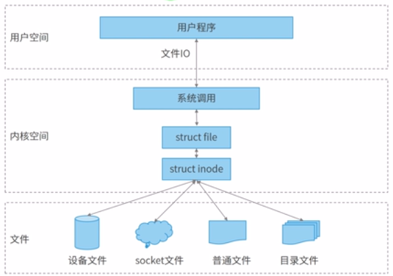

# Linux IO

Everything is file, this is very importent in Linux

There is only one `struct inode` for the one file. And there are some `struct file` mapping the `struct inode`. Using `open` command to open any file, will create one `struct file` instance.